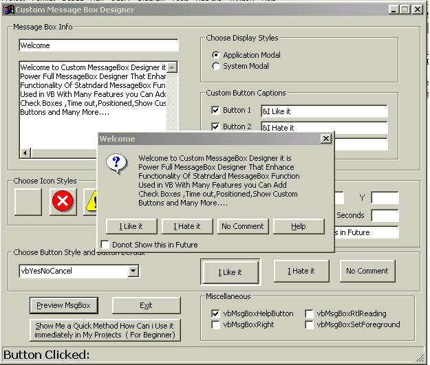



## Extend The Functionality Of MessageBox

### Description

Custom MessageBox Designer is Power Full MessageBox Designer That Enhance

Functionality Of Statndard MessageBox Function

Used in VB With Many Features you Can Add

Check Boxes ,Time out,Positioned,Show Custom

Buttons and Many More....
 
### More Info
 

             |
---                |---
**Submitted On**   |2002-12-08 11:02:04
**By**             |[Adlawa](https://github.com/Planet-Source-Code/PSCIndex/blob/master/ByAuthor/adlawa.md)
**Level**          |Intermediate
**User Rating**    |5.0 (40 globes from 8 users)
**Compatibility**  |VB 3\.0, VB 4\.0 \(16\-bit\), VB 4\.0 \(32\-bit\), VB 5\.0, VB 6\.0
**Category**       |[Custom Controls/ Forms/  Menus](https://github.com/Planet-Source-Code/PSCIndex/blob/master/ByCategory/custom-controls-forms-menus__1-4.md)
**World**          |[Visual Basic](https://github.com/Planet-Source-Code/PSCIndex/blob/master/ByWorld/visual-basic.md)
**Archive File**   |[Extend\_The1509951282002\.zip](https://github.com/Planet-Source-Code/adlawa-extend-the-functionality-of-messagebox__1-41416/archive/master.zip)

